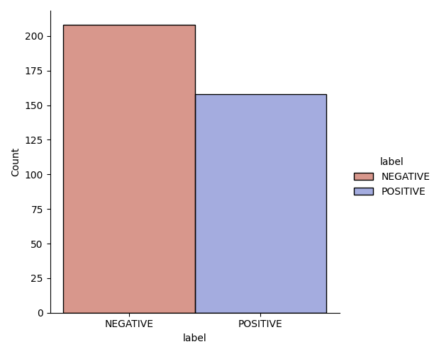
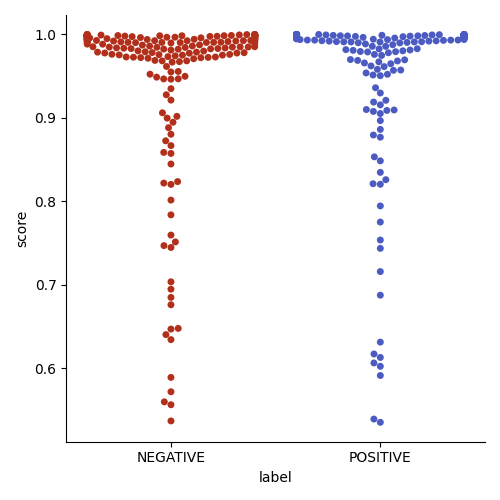
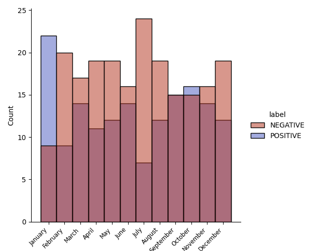

# sentiment-in-the-recollections-of-a-soldier

In this repository I peform sentiment analysis on the personal recollections of a young soldier who served under General Ulysses S. Grant during the American Civil War. The diary spans of the entire year of 1864. The purpose is to explore how machine learning can aid in analysing and visualizing the personal experience of being on the front lines of war.  

Lemuel Abijah Abbott's diary can be accessed on Project Gutenburg via this [link](https://www.gutenberg.org/ebooks/47332)

The script in this repository does the following: 
1. Prepares the text for analysis. The diary has been downloaded as a plain text file and can be found in the ```data``` folder. By using **regex** the dates and entries will be seperated into two separate lists.
2. Peform sentiment analysis on all entries using a Transformers pipeline from the **HuggingFace** library.
3. Saves a csv file to the folder ```out``` with all the data including a new column showing the month using **Pandas**.
4. Saves two text files to the folder ```out``` containing the five entries with the highest certainty score for negative sentiment and positive sentiment respectively. 
5. Creates and saves three visualizations using **Seaborn**. One showing the distribution between negative and positive labels. Another showing the distribution of certainty scores. And a last showing the distribution between labels over the twelve month period.

## User instructions

1. Install the necessary packages listed in the requirements file by using the setup shell script like so:

```bash setup.sh```

2. Run the code in the ```src``` folder by using the run shell script:

```bash run.sh```

## Discussion of results

The illustration below shows the distribution between negative and postive entries: 



As one might expect, Abbott experienced a majority of negative days during his year on the frontlines of war. But perhaps more surprising is the fact that the difference between the two categories is not more stark. Then again, there might also have been much time in between battles.

The next illustration shows the distribution of scores. Lower scores means that the model was less certain about which label to assign. It may also mean that the entry expressed a more neutral or nuanced sentiment: 



the visualization shows, that in the vast majority of cases the model was fairly certain about which label to assign. This is both the case with the negative and the positive label.

The following example is entry that had the highest certainty score in the postive category: 

*"It's a lovely morning; went to Tunbridge with Dr. Jones; fine evening; am to stay at Mr. Isaac Merrill's tonight."*

And likewise for the negative category: 

*"Chilly and cloudy; don't feel very well to-day, nor does anyone else; all stiff and lame; don't wonder at it for we had to march through mud and water ankle deep or more last night from the Rapidan without a rest. The regiments were completely disorganized; officers and men all got lost from their commands and both struggled and straggled into camp as best they could. It was a mob and a disgrace to the Third Corps."*

I had originally hypothesised that the score might reveal something about the intensity of the emotions expressed. However, I now believe that might not be the case since I recall reading entries decribing more harsh conditions. For instance being wounded on both the 9th July and the 19th of September and also seeing the dead and the severely injured. But perhaps the high certainty of the entry above might be due to the fact that every sentence express his sentiment while other negative entries also include further details presented in a more neutral tone.

The final visualization shows the distribution of the labels across the months of 1864:



The distribution show that vast majority of the months were mostly negative. The only exception being January and October. January, in fact, seem to contain a large portion of the positive entries. This is not, as one could expect, due to the fact that he had not been to war yet since he mentions in the first entry being promoted the year before. 

July, on the other hand has the largest distribution of negative entries. This is also the month where major battles took place and where Abbott injured his hip.

Overall, I believe the visualizations illustrate the usefulness of machine learning for historians. This is especially true, when combined with close reading. The visualizations creates a clear representation of the data which may aid in conveying information. 


